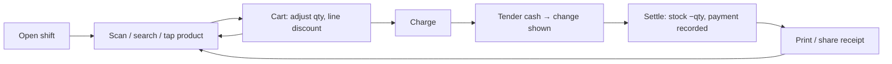

# UX flows

Key flows for Phases 1–5, described surface-neutrally. The POS screen is prototyped in [`pos-mockup.html`](pos-mockup.html) (open it, toggle EN / دری / پښتو, watch the layout mirror for RTL).

## Design principles

- **One-thumb POS on a tablet/phone at the counter.** The primary actions (add item, charge) are large and reachable; everything else is secondary.
- **RTL-first.** Dari is the default locale; the layout mirrors fully. Figures stay Latin and right-aligned by decimal even in RTL.
- **Keyboard/scanner parity.** A barcode scanner acts as keyboard input into the search field; Enter resolves to add-to-cart. Nothing requires a mouse.
- **Never block on the network.** Every action completes locally; a small sync indicator shows pending/settled, never a spinner that stops the sale.

## 1. Cash sale (the hero flow)

Edge cases: out-of-stock (online) blocks with `STOCK_INSUFFICIENT`; offline allows and flags; over-tender shows change; mixed payment splits cash + card.

## 2. Credit / debt sale (nasia)

Pick a customer → ring items → at **Charge**, pay part in cash and place the remainder **on the customer's ledger**. Blocked if it exceeds the credit limit. Later, **Record payment** against the customer reduces the balance (append-only ledger, never an edited total).

## 3. Receive stock (purchase)

From a PO (or ad-hoc) → **Goods receipt**: enter received qty + unit cost per line → posting **increases on-hand** at landed cost and posts a **bill** to the supplier ledger.

## 4. Shift open / close

Open with an opening float (cash count). Close with a counted-cash figure → app computes **expected vs counted variance**; variance is audited. A sale requires an open shift when shifts are enabled.

## 5. Dashboard glance

Owner opens to: today's sales & profit (branch-local day), cash in drawer, top sellers, low-stock alerts, total outstanding debt, and sync status. Read-only projections over the ledgers; no action required to trust them.

## Screen inventory (Phase 1–5)

| Screen | Phase | Notes |
|---|---|---|
| Login / branch+shift select | 1 | offline-capable with cached credentials |
| **POS / sale** | 3 | hero; see mockup |
| Product list / edit | 2 | search, barcode, price, stock |
| Receive stock / PO | 4 | goods receipt |
| Customers / debt ledger | 4 | balance, record payment |
| Reports / dashboard | 5 | projections |
| Settings (locale, numerals, printer, edition) | 1+ | locale + numeral preference live here |
